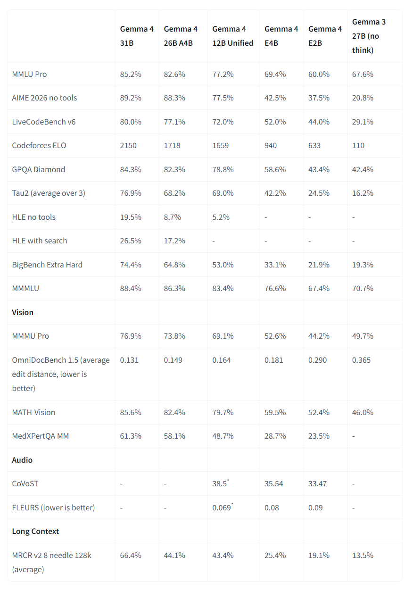

// maintainer todo list to keep track of what he needs to do
// need a place to collect the items when analysing an autorun to not keep trach
--wip

- increase real context to 150k? possible but with a bit slower prefill think 1300 drop to 1200t/s?
  - this is the maximum with this model
    - 5000 buffer in gauge seemed to work fine to motivate handover
    - caching on planner worker switch fails repeatedly - or semi repeatedly
      - check number of contextpoint for the new context size
        - RAM seem ok so far - ok ram overflow or ram freeing action triggers missing cache
  - increaset o 150k not possible - not enough vram. ubatch already at minimum
    

- need to move or rename the agent folder in .opencode
  - it is picked up as a general agents folder and every md file in it is added as a system prompt for aseperate agent to start
  - maybe enough to rename it _agent?
    - might be prodent to name all new folders with prefix _ to prevent clashes with opencode

260915-0325: look for models that might better suited for compaction.
- gemma4-12b is a bit dated but still very solid and fast
- tiny3.0 flash
- Qwen3.6 35B A3B - a bit tooo big for my hardware,
- gemma4 26b A4B - higher in articial rating, but larger in overall size
  - what is its context size?
    - Context Length 	256K tokens
    - Vocabulary Size 	262K
    - Expert Count 	8 active / 128 total and 1 shared
- gemma4 12b should have 256k xontext size
  - why does my version only supper 128k?

good compare of gemma4 models

- check if there are better ways to name folders/use dates that do not lead agents into the dense numerical/data trap
  - misreading constantly of 2026-09-11 -> 2026-09-12
  - these are friction points i want feedback in their summaries :-)
  - number 55 is trumblesome - one agent -> 56, another -> 54
  - "49 + 6: 49 + 1 = 50. 49 + 6 = 50 + 5 = 54? No: 50 + 5 = 54?? 50+5: 50+5 = 54. 50+5 = 54. Aaaarg"
- reference proposal: every number needs a reference like a line number to be included -> double setting makes it more likely to be found when mislabeld
- allowance to just write unknown with line number e.g. - to prevent to often attempts to handcalculate
  - no handcalc in general
  - might need to dump my convo with perplexity AI here about this exact topic - lets see what sticks to the planner in a direct session

260915-1400:
potential models for compaction/text/destillation work
- quant 6 of gemma4-12b might be worthwhile test
-  UD-IQ4_XS 13.6 GB unsloth/gemma-4-26B-A4B-it-GGUF might fit also very well. could be even faster and more intelligent at the same time
  - but low quant might be a problem in MOE architechture of this model
  - MOE works also good with fit and only a part of the experts in the vram 
    - have to test this
- tiny 3.0 in a higher quant maybe? the 4bit quant was not very good. but in general it is seen as very good 
  - so confilicting experience with community exp
  - size?
- unsloth/Qwen3.6-35B-A3B-GGUF or thireus strong candidate - but very big and needs to be offloaded to ram
  - speed? A3B is very small so could be fast non the less
  - prefill will degrade under ram usage i quess - not good for destillation

260915-1740:
a fucking completions request seems to have booted my model out of llama-swap and broken the loop (tid 21740 whoever you are - pid 4 system - so i can not see who send it)
  - INFO [      log_server_request] request | tid="24292" timestamp=1789475771 remote_addr="127.0.0.1" remote_port=54795 status=200 method="POST" path="/v1/chat/completions" params={}
  - Get-Process | Select-Object Name, Id, @{Name="TID"; Expression={(Get-Process -Id $_.Id).Threads.Id}} | Where-Object {$_.TID -contains 21740} -> System  4 {12, 16, 20, 24…}
- remove zed connection to llama-swap DONE
- deactivate any completions features like auto title generation in opencode DONE (as far as i am aware)
